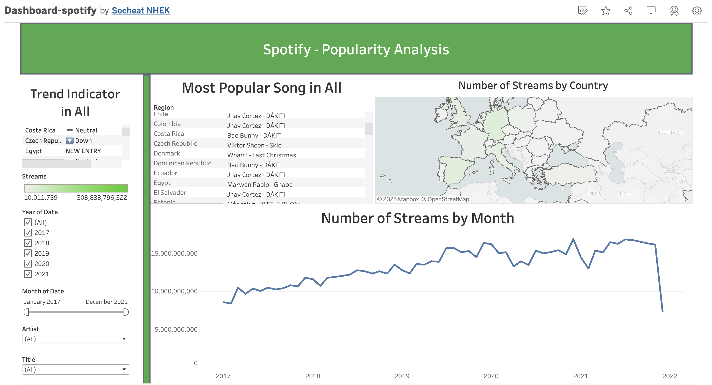
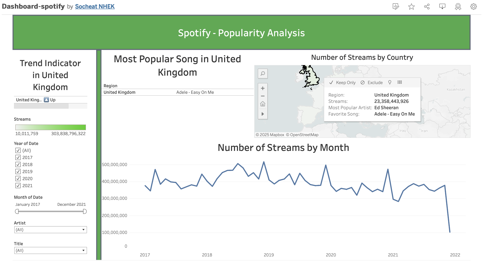
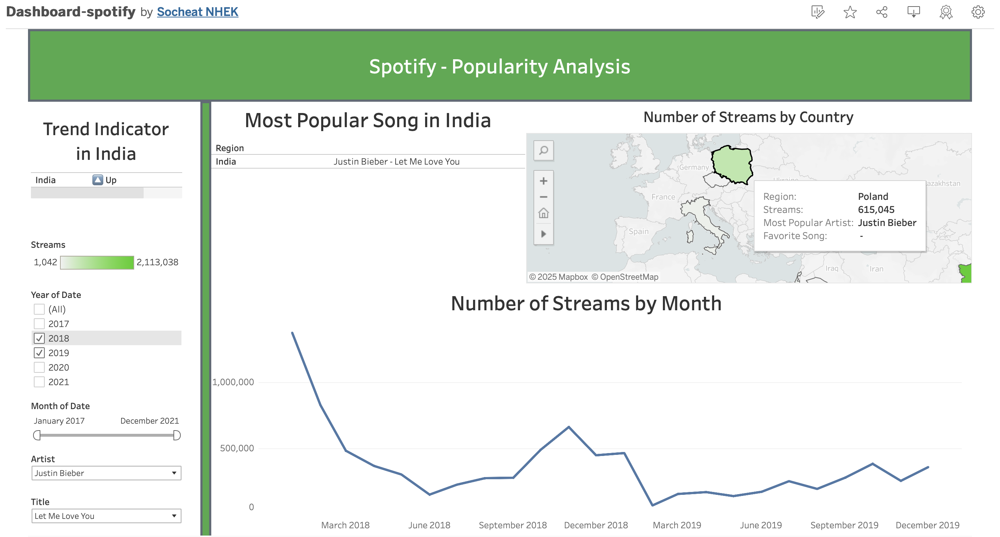

# spotify-popularity

This project aims to visualize the music trends per country over the years in Spotify.   

The dataset used came from Kaggle dataset : https://www.kaggle.com/datasets/dhruvildave/spotify-charts
(Due to a large size file, the dataset cannot be uploaded in GitHub.)

## Situation

The actual records are presented in a tabular type, and possess more than 20,000,000 instances, which make the dataset difficult to understand and analyze. 

We would like to check the popularity of a song, or artist over the years in Spotify for a global audience.    

## Task

Creating an interactive dashboard to check the popularity of a song or artist per country, in a user-friendly way. 

## Actions

<ins>1. Data Quality:</ins>
- Loading the dataset
- Counting unique values per column
- Checking types of the columns
- Checking missing values

<ins>2. Data preparation</ins>
- Removing missing values
- Explode the dataset. The "artist" columns may contains a list of artists. In this case, "exploding" the dataset transform list of artists into indivual artist by adding new rows.
- Reducing the number of rows to get 15,000,000 instances. (Tableau Public only works with less than 15,000,000 rows of data)
- Saving the new table in csv format for Tableau entry. 

<ins>3. Tableau</ins>
- Creating a Map, split by region and use it as filter
- Plotting a linechart realted to the number of streams per month
- Displaying the most Popular song per Country (with a formula related to the max number of streams per country)
- Displaying the latest trend indicator (Moving up, moving down, equal or new entry)

## Results

Here is an overview of the dashboard created in Tableau.  
On the left you can see the filtering options with the years and months, also a drop-down lists on artist and title song. 

The main grpahs are composes of a map (that can be used as filter too), the evolution of the number of streams per month and also the most popular song by country and its trend movement.   

If we filter in the UK as you can see above, it seems that "Adele - Easy on Me" is the most popular song and it's trending up, even if the number of streams seems to fall down in 2022.  
Also, the tooltip gives us information about the favorite artist in the selected country. Although "Adele - Easy on Me" is the favorite song of the English citizens, Ed Sheeran is their favorite artist...

Furthermore, we can filter the dashboard per song. In this example, we filtered with the song "Justin Bieber - Let Me Love You".  
The trend indicator shows only India as a country, but people outside of India listen to this song too by looking the map...  Seems like the trend indicator is missing for other countries for this song in our database.  

## Lessons Learned

- Some songs involved multiple artists and are written as a list in the csv file.  Preprocessing the dataset before loading in Tableau can be useful. In this case, we use the "explode" method that transform list of artists into indivual artist by adding new rows. 
- GitHub repository doesn't accept file that exceeds 25 MB, and 2GB if you use Git LFS (Large File Storage). A solution can be to split the dataset into multiple parts, or use a cloud storage service. 
- A simple way to connect GitHub repository and VSCode is to first create the repository in your GitHub account, and use git clone in VSCode. To avoid pushing large files, which can lead to push issues, you can add a .gitignore.  
- In Tableau, "Global" region is not recognized.
